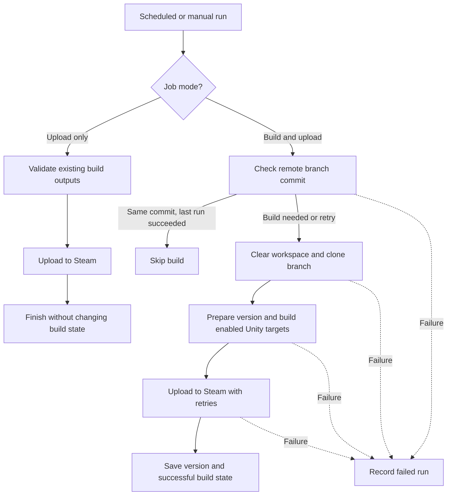

# unity-build-bot

Local, generic job that watches a git branch for new commits, pulls,
builds a Unity project headlessly, and uploads the build to Steam via
SteamPipe (steamcmd). Runs on Windows or macOS, driven by the OS scheduler
(no daemon required).

## How it works



A changed branch or a failed previous run also triggers a build, even if the
commit SHA matches the saved one. Build runs clean up the workspace on exit;
upload-only runs keep the existing outputs and do not update build state.

## Layout

```
config/
  config.example.yaml   # copy to config.yaml (gitignored) and edit
  config.example.macos.yaml   # explicit macOS starter config
  config.example.windows.yaml # explicit Windows starter config
  secrets.example.yaml   # optional, copy to secrets.yaml (gitignored)
src/unity_build_bot/
  cli.py                 # entry point: `run`, `upload`, and `status` subcommands
  config.py              # loads config.yaml, expands ${ENV_VAR}
  git_watcher.py         # ls-remote polling + clean pull
  unity_builder.py        # invokes Unity -batchmode
  steam_uploader.py       # generates vdf + runs steamcmd
  version_file.py         # reads/bumps version.txt
  state.py                # last built SHA / version / status (JSON)
  logging_utils.py        # file + console logging
unity_editor/Editor/BuildScript.cs   # copy into your Unity project's Assets/Editor/
scripts/
  schedule_windows_task.ps1   # registers a Windows Task Scheduler job
  schedule_macos_launchd.sh   # installs a macOS launchd agent
```

## Setup

1. Set up Python using the instructions below.
2. Copy the starter config for your operating system and fill in the repository, Unity, and Steam values.
3. Add `BuildScript.cs` to the Unity project and ensure its root contains `version.txt`.
4. Install SteamCMD and log in once interactively.
5. Run `unity-build-bot doctor` and fix any reported setup failures.
6. Run the job once manually; install the scheduler only after it succeeds.

For private HTTPS remotes, set `auth_token_env: "GIT_TOKEN"` and either define
`GIT_TOKEN` in the environment or copy `config/secrets.example.yaml` to
`config/secrets.yaml` and fill in the token. Environment variables take
precedence. SSH remotes continue to use the machine's SSH agent.

### Set up Python

Python 3.10 or newer is required. Run these commands from the repository root.
The project uses `.venv` so its dependencies do not affect the system Python.
Activation is optional because the commands below invoke `.venv` directly.

#### macOS

1. Verify Python is available and is version 3.10 or newer:

  ```bash
  python3 --version
  ```

  If the command is missing or reports an older version, install a current
  Python release from [python.org](https://www.python.org/downloads/macos/)
  or with Homebrew: `brew install python`.

2. Create the virtual environment and install the bot:

  ```bash
  python3 -m venv .venv
  .venv/bin/python -m pip install --upgrade pip
  .venv/bin/python -m pip install -e .
  ```

3. Confirm that the command was installed:

  ```bash
  .venv/bin/unity-build-bot --help
  ```

4. Copy the macOS starter configuration and edit it:

  ```bash
  cp config/config.example.macos.yaml config/config.yaml
  ```

5. If using HTTPS Git authentication, copy the optional secrets file and add the token:

  ```bash
  cp config/secrets.example.yaml config/secrets.yaml
  ```

6. Check the complete setup before building:

  ```bash
  .venv/bin/unity-build-bot doctor --config config/config.yaml
  ```

7. After completing the Unity and SteamCMD setup, run the job once manually:

  ```bash
  .venv/bin/unity-build-bot run --config config/config.yaml
  ```

8. When the manual run succeeds, install the scheduler:

  ```bash
  chmod +x scripts/schedule_macos_launchd.sh
  ./scripts/schedule_macos_launchd.sh "$(pwd)" 300
  ```

9. To stop and remove the scheduler later:

  ```bash
  ./scripts/schedule_macos_launchd.sh --uninstall
  ```

  To run another config at the same time, supply its path as the third
  argument; omit it to use `config/config.yaml`. Remove only that job by
  specifying the same path:

  ```bash
  ./scripts/schedule_macos_launchd.sh "$(pwd)" 300 config/config.macos-extra.yaml
  ./scripts/schedule_macos_launchd.sh --uninstall "$(pwd)" config/config.macos-extra.yaml
  ```

#### Windows PowerShell

1. Verify Python is available and is version 3.10 or newer:

  ```powershell
  py --version
  ```

  If the command is missing or reports an older version, install a current
  Python release from [python.org](https://www.python.org/downloads/windows/).
  During installation, enable the Python launcher and add Python to `PATH`.

2. Create the virtual environment and install the bot:

  ```powershell
  py -m venv .venv
  .\.venv\Scripts\python.exe -m pip install --upgrade pip
  .\.venv\Scripts\python.exe -m pip install -e .
  ```

3. Confirm that the command was installed:

  ```powershell
  .\.venv\Scripts\unity-build-bot.exe --help
  ```

4. Copy the Windows starter configuration and edit it:

  ```powershell
  Copy-Item config\config.example.windows.yaml config\config.yaml
  ```

5. If using HTTPS Git authentication, copy the optional secrets file and add the token:

  ```powershell
  Copy-Item config\secrets.example.yaml config\secrets.yaml
  ```

6. Check the complete setup before building:

  ```powershell
  .\.venv\Scripts\unity-build-bot.exe doctor --config config\config.yaml
  ```

7. After completing the Unity and SteamCMD setup, run the job once manually:

  ```powershell
  .\.venv\Scripts\unity-build-bot.exe run --config config\config.yaml
  ```

8. When the manual run succeeds, install the scheduler:

  ```powershell
  powershell -ExecutionPolicy Bypass -File scripts\schedule_windows_task.ps1
  ```

9. To stop and remove the scheduler later:

  ```powershell
  powershell -ExecutionPolicy Bypass -File scripts\schedule_windows_task.ps1 -Uninstall
  ```

  To run another config at the same time, pass `-ConfigPath`; omit it to use
  `config/config.yaml`. Remove only that job with the same path:

  ```powershell
  powershell -ExecutionPolicy Bypass -File scripts\schedule_windows_task.ps1 -ConfigPath config\config.windows-extra.yaml
  powershell -ExecutionPolicy Bypass -File scripts\schedule_windows_task.ps1 -Uninstall -ConfigPath config\config.windows-extra.yaml
  ```

Each config path has a separate scheduler entry; the generic config keeps its
original job name. To run multiple bots concurrently, assign each config its
own `git.workspace_root`, build output directories, `logging.log_dir`, and
`state.state_file` parent directory (which also holds the run lock).

Both scheduler scripts use the Python interpreter inside `.venv`. Do not
delete or move `.venv` after installing the scheduled job; recreate the job
if the repository is moved. Uninstalling removes only the scheduler entry; it
does not delete configuration, logs, state, build output, or the repository.

Relative paths in a config under `config/` resolve from the project root, so
the same config works when invoked manually or by either scheduler.

### Set up SteamCMD

SteamCMD needs a one-time interactive login before the bot can upload builds
without supervision. Use a dedicated Steam build account that has permission
to upload the configured app and depots.

#### macOS

1. Create a dedicated installation directory and download SteamCMD:

    ```bash
    mkdir -p ~/steamcmd
    cd ~/steamcmd
    curl -fsSL https://steamcdn-a.akamaihd.net/client/installer/steamcmd_osx.tar.gz | tar -xz
    ```

2. Start SteamCMD and log in once:

    ```bash
    ~/steamcmd/steamcmd.sh +login <builder_account> +quit
    ```

3. Enter the account password and Steam Guard code when prompted. Never put
    the password or Steam Guard code in `config.yaml`.

4. Verify the executable and cached session:

    ```bash
    test -x ~/steamcmd/steamcmd.sh && echo "SteamCMD is installed"
    test -f "$HOME/Library/Application Support/Steam/config/config.vdf" && echo "Steam session is ready"
    ```

5. Configure the matching paths:

   ```yaml
   steam:
     steamcmd_path: "~/steamcmd/steamcmd.sh"
     config_vdf_path: "~/Library/Application Support/Steam/config/config.vdf"
     username: "your-steam-builder-account"
   ```

#### Windows PowerShell

1. Create a dedicated installation directory and download SteamCMD:

   ```powershell
   New-Item -ItemType Directory -Force C:\steamcmd | Out-Null
   Invoke-WebRequest `
     https://steamcdn-a.akamaihd.net/client/installer/steamcmd.zip `
     -OutFile C:\steamcmd\steamcmd.zip
   Expand-Archive C:\steamcmd\steamcmd.zip C:\steamcmd -Force
   ```

2. Start SteamCMD and log in once:

    ```powershell
    C:\steamcmd\steamcmd.exe +login <builder_account> +quit
    ```

3. Enter the account password and Steam Guard code when prompted. Never put
    the password or Steam Guard code in `config.yaml`.

4. Verify the executable and cached session:

    ```powershell
    Test-Path C:\steamcmd\steamcmd.exe
    Test-Path C:\steamcmd\config\config.vdf
    ```

5. Configure the matching paths. Forward slashes avoid YAML escaping issues:

   ```yaml
   steam:
     steamcmd_path: "C:/steamcmd/steamcmd.exe"
     config_vdf_path: "C:/steamcmd/config/config.vdf"
     username: "your-steam-builder-account"
   ```

The scheduled task must run as the same operating-system user that performed
the SteamCMD login. If Steam invalidates the cached session, repeat the login
command and complete Steam Guard again. You can then rerun the bot without
changing its configuration.

### Configure platform builds

Add one entry to `unity.builds` for each platform. Set `enabled` to select
macOS, Windows, or both without removing either definition. Each build needs
a unique ID, Unity build target, output directory, and output name. Map the
enabled IDs to Steam depot IDs under `steam.depots`. The bot builds every
enabled entry first, then uploads their depots together as one Steam app build.

```yaml
unity:
  builds:
    - id: macos
      enabled: true
      build_target: StandaloneOSX
      output_subdir: workspace/build/macos
      build_name: Game
    - id: windows
      enabled: false
      build_target: StandaloneWindows64
      output_subdir: workspace/build/windows
      build_name: Game

steam:
  depots:
    macos: "123457"
```

  Set only `macos.enabled` to `true` for macOS, only `windows.enabled` to `true`
  for Windows, or both to `true` to build both platforms. An enabled build must
  have a matching depot; disabled builds may omit their depot mapping.

Install the macOS and Windows build-support modules for the configured Unity
Editor version. Existing configs with one `build_target`, `output_subdir`,
`build_name`, and `depot_id` remain supported.

### Version labels

The starter configs append the detected commit's short hash to each build
version. For example, with `version.txt` set to `1.0.0` and automatic patch
increments enabled, the build version is `1.0.1.abcdef1`. Configure it under
`versioning`:

```yaml
versioning:
  auto_increment: true
  bump_part: "patch"
  append_short_commit_hash: true
  short_commit_hash_length: 7
```

Set `append_short_commit_hash` to `false` to keep plain semantic versions.
The hash suffix is used for the build and recorded state; `version.txt` keeps
only the incremented base version so the next build can bump it normally.

The state file records the last detected commit SHA, generated build version,
branch, status, and run time even when a build fails. Failed commits remain
eligible for retry on the next scheduled run.

### Steam build descriptions

`steam.build_description` supports metadata placeholders so Steamworks builds
are searchable and traceable:

```yaml
steam:
  build_description: "{version} | {branch} | {short_sha} | {targets} | automated"
```

- `{version}` is the generated build version.
- `{branch}` is the configured Git branch.
- `{short_sha}` is the detected commit hash shortened using
  `versioning.short_commit_hash_length`.
- `{targets}` is the comma-separated list of enabled build IDs.

An empty description retains the timestamp fallback. Upload-only runs use the
saved state metadata; unavailable values appear as `unknown`.

### Test without installing the bot

From the repository root, use the platform-specific steps below. These
commands require Python and the runtime dependency `PyYAML`, but do not
require installing the bot package.

#### macOS

```bash
export PYTHONPATH="$PWD/src"
python3 -m unity_build_bot doctor --config config/config.yaml
# Replace "doctor" with "run" to run the actual job once.
python3 -m unity_build_bot run --config config/config.yaml
```

#### Windows PowerShell

```powershell
$env:PYTHONPATH = "$PWD\src"
py -m unity_build_bot doctor --config config/config.yaml
# Replace "doctor" with "run" to run the actual job once.
py -m unity_build_bot run --config config/config.yaml
```

The `doctor` command checks that the configuration and required tools are
usable. The `run` command can pull the Unity project, build it, and upload it
to Steam.

### Upload existing builds only

Use `upload` when the build outputs already exist and you only want to publish
them to Steam. This mode does not check Git, clear `git.workspace_root`, clone,
run Unity, bump the version file, or update `last_built_sha`.

For scheduled runs, set the job mode in `config.yaml`:

```yaml
job:
  mode: "upload_only"
```

Leave it as `build_and_upload` for the normal Git sync, Unity build, and Steam
upload workflow.

Steam uploads are retried three times after a timeout, connection failure, or
credential/session failure. Configure the retry count and delay under `job`:

```yaml
job:
  steam_upload_retries: 3
  steam_upload_retry_delay_seconds: 30
```

The scheduler uses a run lock. If a previous run is still active when the
next scheduled interval starts, the new invocation logs that it was skipped
and the scheduler tries again at the next interval. The workspace is cleaned
up after successful, failed, and upload-only runs.

#### macOS

```bash
.venv/bin/unity-build-bot upload --config config/config.yaml
```

#### Windows PowerShell

```powershell
.\.venv\Scripts\unity-build-bot.exe upload --config config\config.yaml
```

Every enabled `unity.builds` entry must already have files in its configured
`output_subdir`. Disabled builds are ignored.

### Live activity window

Enable the optional terminal window in `config.yaml`:

```yaml
logging:
  show_activity_window: true
```

At `logging.level: INFO`, the window shows step starts, finishes, outcomes,
the branch and commit, and commands executed (with credentials masked as `****`).
Failures that stop the run are logged at ERROR; retryable attempts are WARNING.
Set `logging.level: DEBUG` to also see Git, Unity, and SteamCMD command output
and detailed activity. The window closes when the bot process finishes. The
daily log remains available under `logging.log_dir` whether or not the window
is enabled.

The window requires an active logged-in desktop session. Scheduled jobs that
run while the user is logged out cannot display UI, but they continue writing
to the log file normally.

## Notes / design decisions

- **No secrets in config.yaml.** `config.yaml` and `secrets.yaml` are gitignored; use `secrets.yaml`, environment variables, or the OS keychain for anything sensitive.
- **Logs are kept outside git** (default `~/.unity-build-bot/logs`), not committed to the game repo, to avoid leaking machine paths/usernames and repo bloat.
- **Polling, not a webhook**, for simplicity — `git ls-remote` is cheap and doesn't require inbound networking on the build machine.
- **Platform support is required.** The Unity installation running the job must include a build-support module for every target in `unity.builds`.
- **The complete workspace is disposable.** Before each build synchronization, the bot deletes `git.workspace_root`, recreates it, and freshly clones the repository into `git.workdir`. Build outputs inside the workspace are also removed. Keep no files there that are not safe to delete.
